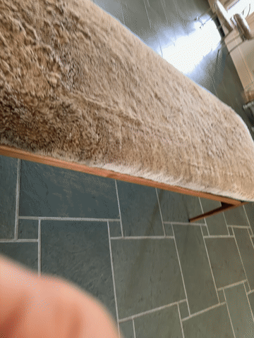

# video-to-gaussian-splat-for-claude-code

Turn a video into a realistic 3D scene — entirely on your own machine.

```
video --ffmpeg--> frames --COLMAP--> camera poses + sparse point cloud --Brush--> splat.ply
```

| Source video | Resulting splat |
|---|---|
|  |  |

## Why this exists

The motivation is simple: transform videos into realistic 3D scenes. That's it. This repository wires ffmpeg, COLMAP, and Brush together with the file layout, settings, and operational lessons (which matcher to use at what dataset size, how to tell a healthy run from a thrashing one, why a "small" dataset can still take hours if the machine's memory is oversubscribed) needed to actually get a video-to-splat pipeline working reliably on a normal Mac or Windows machine.

## What it does

1. **ffmpeg** samples frames from your source video(s).
2. **COLMAP** performs structure-from-motion: from the frames alone, it estimates where the camera was for every shot and produces a sparse 3D point cloud.
3. **Brush** trains a Gaussian Splat from COLMAP's cameras + point cloud — the actual optimization step that turns sparse points into a dense, renderable 3D scene.
4. **`scripts/normalize_up.py`** levels the result. COLMAP has no notion of true gravity, so the reconstruction's "up" is usually tilted a few degrees off vertical — this averages every registered camera's own "up" direction (a handheld walkthrough keeps the phone roughly upright on average) and rotates the whole splat to align it with true vertical. A post-process on the finished `.ply`, no retraining needed.

The output of step 3 is a single `.ply` file — a Gaussian Splat — that can be viewed, shared, or brought into any tool that understands the format. See [Viewing a result](#viewing-a-result) below.

## Requirements

**macOS**
- Apple Silicon (M1 or later)
- [Homebrew](https://brew.sh) — installs `ffmpeg` and `colmap`
- [Brush](https://github.com/ArthurBrussee/brush/releases) (`aarch64-apple-darwin` build) — no package-manager formula exists for it; download the binary directly

**Windows**
- [Chocolatey](https://chocolatey.org) — installs `ffmpeg`
- [COLMAP](https://github.com/colmap/colmap/releases) — no Chocolatey package exists; download the Windows build directly (an NVIDIA GPU here gets you CUDA-accelerated matching, meaningfully faster than the CPU-only path this project uses on Mac)
- [Brush](https://github.com/ArthurBrussee/brush/releases) — Windows build, same as above, direct download

Both platforms: enough free RAM matters more than dataset size. Gaussian Splat training memory use grows as training adds more splats, independent of how big your input video was — see [AGENTS.md](AGENTS.md) for the specific failure mode (silent swap-thrashing, not a crash) and how to spot it.

## Usage

Full step-by-step commands, folder conventions, and every operational gotcha this project has actually run into live in [AGENTS.md](AGENTS.md) — it's written to be followed directly (by you or by a coding agent dropped into this repo). Short version:

```bash
# 1. Extract frames
ffmpeg -i raw/your_video.mov -vf "fps=1" video1/frame_%05d.jpg

# 2. COLMAP structure-from-motion (exhaustive_matcher under ~500 images,
#    vocab_tree_matcher above that — see AGENTS.md for why and the exact flags)
colmap feature_extractor --database_path colmap_workspace/database.db --image_path images_combined
colmap exhaustive_matcher --database_path colmap_workspace/database.db
colmap mapper --database_path colmap_workspace/database.db --image_path images_combined --output_path colmap_workspace/sparse

# 3. Train the splat
brush_app brush_dataset --with-viewer --total-steps 15000 --export-path brush_output --export-name splat.ply

# 4. Level it (requires numpy + scipy: python3 -m pip install numpy scipy)
python3 scripts/normalize_up.py --colmap-sparse colmap_workspace/sparse/0 --ply brush_output/splat.ply
```

Project folders are organized as `<project_name>/object_N/`, each one a fully independent capture — see AGENTS.md for the exact layout and why reconstructions are never merged at the raw-frame level.

## Viewing a result

This project does not ship its own splat viewer. Use one of:

- **Brush's own viewer**, entirely local: `~/bin/brush_app path/to/splat.ply`
- **[SuperSplat's hosted editor](https://superspl.at/editor)** — drag-and-drop the `.ply`, no install. Full PlayCanvas rendering and orbit/fly camera controls, at the cost of uploading the file to a third-party site.

## Project structure

```
AGENTS.md               full pipeline reference: commands, folder layout, every gotcha
scripts/                pipeline scripts (e.g. normalize_up.py)
docs/superpowers/specs/ design docs for ongoing work on this repo
example/                a worked example reconstruction (frames → COLMAP → Brush output)
```

## Status / roadmap

The pipeline above works today, run by hand or by a coding agent following AGENTS.md. Still on the roadmap: fully autonomous dependency setup (an agent checking for and installing Homebrew/Chocolatey/COLMAP/Brush on request) and a checklist-driven run through the whole pipeline with resumable failure handling. See `docs/superpowers/specs/` for the current design.

## Credits

- [COLMAP](https://colmap.github.io/) — structure-from-motion
- [Brush](https://github.com/ArthurBrussee/brush) — Gaussian Splat training, Rust/wgpu
- Gaussian Splatting itself: Kerbl, Kopanas, Leimkühler, Drettakis, *3D Gaussian Splatting for Real-Time Radiance Field Rendering*, SIGGRAPH 2023
